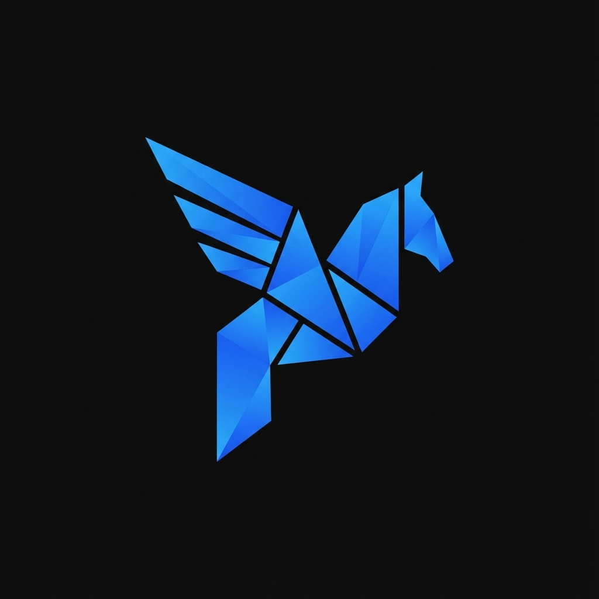
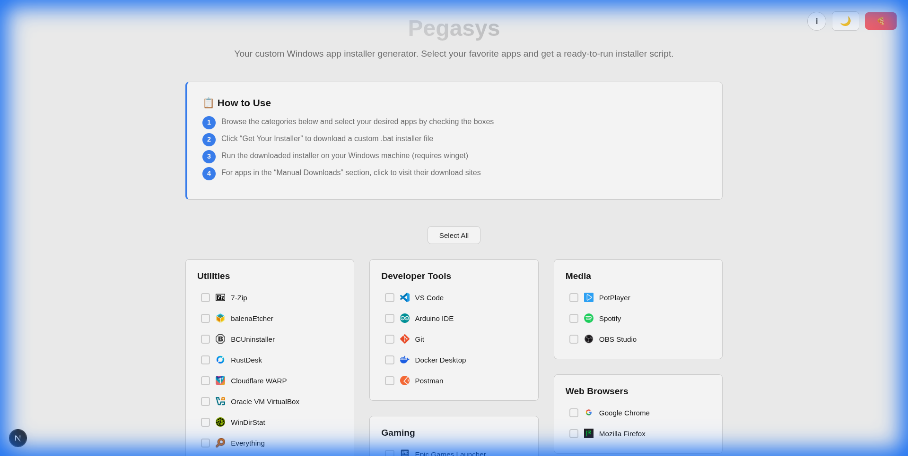
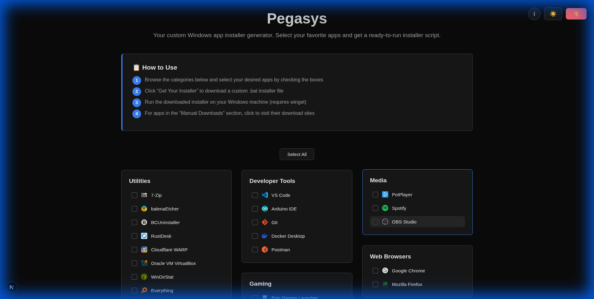

# Pegasys

<p align="center">
  
</p>

<p align="center"><strong>Your custom Windows app installer generator.</strong></p>

Pegasys is a modern web application that generates custom Windows installer scripts powered by [winget](https://learn.microsoft.com/en-us/windows/package-manager/winget/). Simply select your favorite apps from curated categories, and get a ready-to-run batch installer for fresh Windows setups.

### Screenshots

<details open>
<summary>Dark Mode</summary>



</details>

<details>
<summary>Light Mode</summary>



</details>


## Features

- **Curated App Selection** - Browse apps organized by categories (Browsers, Developer Tools, Media, Gaming, etc.)
- **Automated Installation** - Generate batch scripts using Windows Package Manager (winget)
- **Dark/Light Mode** - Theme support with localStorage persistence
- **Responsive Design** - Works seamlessly on desktop, tablet, and mobile
- **Masonry Layout** - Pinterest-style column layout for efficient space usage
- **Fast & Modern** - Built with Next.js 16 and deployed on Cloudflare Pages
- **Manual Downloads** - Links to apps that require manual installation

## Getting Started

### Prerequisites

- [Node.js](https://nodejs.org/) 20.x or higher
- npm or yarn package manager

### Installation

1. **Clone the repository**

   ```bash
   git clone https://github.com/yourusername/pegasys.git
   cd pegasys
   ```

2. **Install dependencies**

   ```bash
   npm install
   ```

3. **Run the development server**

   ```bash
   npm run dev
   ```

4. **Open your browser**

   Navigate to [http://localhost:3000](http://localhost:3000)

## Tech Stack

- **Framework**: [Next.js 16](https://nextjs.org/) with App Router
- **Styling**: Vanilla CSS with CSS variables for theming
- **Deployment**: [Cloudflare Pages](https://pages.cloudflare.com/) with [@opennextjs/cloudflare](https://opennext.js.org/cloudflare)
- **Package Manager**: npm
- **Runtime**: Node.js 20

## How to Use

1. **Browse Categories** - Explore apps organized by category
2. **Select Apps** - Check the boxes next to apps you want to install
3. **Download Installer** - Click "Get Your Installer" to download a `.bat` file
4. **Run on Windows** - Execute the batch file on your Windows machine
5. **Manual Downloads** - Visit links for apps requiring manual installation

### Requirements for Running the Installer

- **Windows 10/11** (x64)
- **winget** installed (included with Windows 11, or install [App Installer](https://apps.microsoft.com/detail/9nblggh4nns1) on Windows 10)

## Customization

### Adding New Apps

Edit `src/data/apps.ts` to add new applications:

```typescript
{
  id: 'app-id',
  name: 'App Name',
  category: 'Category',
  wingetId: 'Publisher.AppName', // For automated installs
  // OR
  manualUrl: 'https://example.com/download', // For manual downloads
  website: 'example.com'
}
```

### Modifying Categories

Categories are automatically generated from the apps data. Simply use a new category name when adding apps.

### Theming

Theme colors are defined in `src/app/globals.css` using CSS variables:

```css
[data-theme="dark"] {
  --background: #0a0a0a;
  --foreground: #ededed;
  --primary: #3b82f6;
  /* ... */
}

[data-theme="light"] {
  --background: #f5f5f5;
  --foreground: #1a1a1a;
  /* ... */
}
```

## Deployment

This project is configured for automatic deployment to [Cloudflare Pages](https://pegasys.dansarpong.com).

## Contributing

Contributions are welcome! This project was made for personal use, but feel free to:

- Fork the repository
- Create a feature branch (`git checkout -b feature/AmazingFeature`)
- Commit your changes (`git commit -m 'Add some AmazingFeature'`)
- Push to the branch (`git push origin feature/AmazingFeature`)
- Open a Pull Request

## License

This project is licensed under the **GNU General Public License v3.0** - see the [LICENSE](LICENSE) file for details.

### What this means

- You can use, modify, and distribute this software
- You can use it for commercial purposes
- Any modifications must also be open-sourced under GPL v3
- You must include the original copyright and license notice

## Support

If you find this project useful, consider buying me a slice of pizza!

[](https://www.buymeacoffee.com/dansarpong)

## Contact

- **Author**: Daniel Sarpong
- **GitHub**: [@dansarpong](https://github.com/dansarpong)
- **Website**: [dansarpong.com](https://dansarpong.com)

## Acknowledgments

- [winget](https://github.com/microsoft/winget-cli) - Windows Package Manager
- [Next.js](https://nextjs.org/) - The React Framework
- [Cloudflare Pages](https://pages.cloudflare.com/) - Deployment platform
- All the amazing apps featured in this project

---

**Note**: This is an unofficial tool and is not affiliated with Microsoft or any of the applications featured. All trademarks belong to their respective owners.

